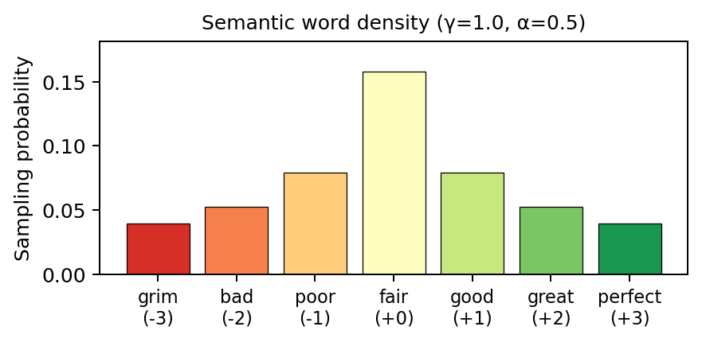

The bag-of-words (BoW) setup isolates noise-robustness of SL, REINFORCE, GRPO, and MaxRL in a **zero-step rollout** setting: the model sees a single prompt and predicts a scalar target with no sequential reasoning. There are three versions of the dataset:

1. **Homogeneous hardness**: a single, global signal-to-target corr $\rho$.
2. **Unlearnable heteroskedasticity**: global signal corr $\rho$, together with a random by-row noise skew.
3. **Learnable heteroskedasticity**: global signal corr $\rho$, and a learnable, by-semantic-word noise skew.

## Dataset

### Homogeneous version

See [`src/data/bag_of_words.py`](/src/data/bag_of_words.py).

Each prompt is $L$ words sampled iid from a mixture of **semantic words**, which carries signal, and **auxiliary words**, which are pure fillers. The target is a noise-corrupted linear function of word content, parameterized by the correlation between signal and target $\rho \in (0, 1]$.

**7-word vocabulary.** Semantic words map to integer values centered at zero:

| grim | bad | poor | fair | good | great | perfect |
|:----:|:---:|:----:|:----:|:----:|:-----:|:-------:|
| $-3$ | $-2$ | $-1$ | $0$ | $+1$ | $+2$ | $+3$ |

The 256 auxiliary words (common function words: *the, a, and, if, because, ...*) carry value 0. We also define variants with more (e.g. $11$, $15$) semantic words.

**Sampling distribution.** Semantic words share mass $1 - \alpha$ (where $\alpha$ = `aux_words_ratio`), shaped by a power-law centered on the neutral word "fair": $p_i \propto (1 + |i - \text{center}|)^{-\gamma}$. Auxiliary words uniformly split mass $\alpha$.

{width=65%}

**Target generation.** Given a prompt of length $L$:
$$
\text{signal} = \frac{\rho}{\sigma\sqrt{L}} \sum_{i=1}^L v_i, \qquad
\text{target} = \text{signal} + \mathcal{N}(0, \sqrt{1 - \rho^2})
$$
where $\sigma$ is the per-token standard deviation under the full mixture (zero mean by symmetry). By construction $\text{Var}(\text{target}) = 1$ and $\text{corr}(\text{signal}, \text{target}) = \rho$.

#### Examples

Consider 8-word prompts; we compute the _per-word signal stdev_ $\sigma = 1.14$, so the per-prompt stdev $\sqrt{L}\,\sigma = 3.21$. Semantic words are **bolded**:

**Low-signal regime**: $\rho = 0.01$ — multiplier $\rho / (\sigma \sqrt{L}) = 0.0031$, noise stdev $\sqrt{1 - \rho^2} \approx 1.00$:

> both idea **fair** **poor** rather **bad** **grim** then

$\sum v_i = -6$, signal $= 0.0031 \times (-6) = -0.019$, target $= -2.54$

**High-signal regime**: $\rho = 0.89$ — multiplier $= 0.277$, noise stdev $\sqrt{1 - \rho^2} = 0.46$:

> **good** **good** floor **good** **good** **good** **perfect** **poor**

$\sum v_i = +7$, signal $= 0.277 \times 7 = 1.94$, target $= 1.78$

### Row-level heteroskedasticity (unlearnable)

The first heteroskedastic variant has unlearnable per-sample hardness: sample $i$ is assigned a stratified hardness quantile $u_i \in (0, 1)$ (uniformly permuted) and a **median-pegged exponential** noise multiplier
$$
\tilde a(u) = 2^{(u - 1/2) \,/\, h_{\text{row}}}, \qquad
a_i = \tilde a(u_i) \,/\, \sqrt{\mathbb{E}_u[\tilde a(u)^2]},
$$
where $h_{\text{row}}$ = `snr_halflife_in_quantile` is the quantile distance over which SNR halves. The RMS normalization fixes $\mathbb{E}[a_i^2] = 1$, so the target model
$$
\text{target}_i = \text{signal}_i + \sqrt{1-\rho^2}\, a_i\, \varepsilon_i
$$
preserves the **global** correlation $\text{Corr}(\text{signal}, \text{target}) = \rho$.

```{=html}
<script>
window.fitScaledIframeContainer = window.fitScaledIframeContainer || function(frame) {
  const iframe = frame.querySelector("iframe");
  const sourceWidth = Number(frame.dataset.sourceWidth);
  const sourceHeight = Number(frame.dataset.sourceHeight);
  if (!iframe || !sourceWidth || !sourceHeight) return;
  const displayWidth = frame.clientWidth || sourceWidth;
  const scale = Math.min(1, displayWidth / sourceWidth);
  frame.style.height = `${Math.ceil(sourceHeight * scale)}px`;
  iframe.style.width = `${sourceWidth}px`;
  iframe.style.height = `${sourceHeight}px`;
  iframe.style.transform = `scale(${scale})`;
};
window.addEventListener("DOMContentLoaded", () => {
  const frames = document.querySelectorAll(".scaled-plotly-frame");
  frames.forEach(window.fitScaledIframeContainer);
  if ("ResizeObserver" in window) {
    const obs = new ResizeObserver((es) =>
      es.forEach((e) => window.fitScaledIframeContainer(e.target))
    );
    frames.forEach((f) => obs.observe(f));
  } else {
    window.addEventListener("resize", () =>
      frames.forEach(window.fitScaledIframeContainer)
    );
  }
});
</script>

<div class="scaled-plotly-frame" data-source-width="900" data-source-height="620">
  <iframe src="assets/bow/row_heteroskedasticity.html"
          width="900" height="620" scrolling="no"
          onload="window.fitScaledIframeContainer(this.parentElement);"></iframe>
</div>
```

### Word-level heteroskedasticity (learnable)

We propose another heteroskedastic variation where hardness is tied to **word content**, so it is in principle recoverable from the prompt. Semantic words are ranked by $|v(w)|$ (ties share their average rank, preserving sign symmetry) and assigned a quantile $q(w) \in (0, 1)$; auxiliary words carry zero hardness. The raw per-word multiplier is
$$
\tilde a(w) \;=\; \begin{cases} 2^{(q(w) - 1/2)\,/\,h_{\text{word}}} & w \text{ semantic},\\ 0 & w \text{ auxiliary}, \end{cases}
$$
with $h_{\text{word}}$ = `snr_halflife_in_word_quantile`. For a prompt $x = (w_1, \dots, w_L)$ the prompt-level multiplier is the per-token RMS
$$
\tilde A(x)^2 = \frac{1}{L} \sum_{j=1}^{L} \tilde a(w_j)^2,
\qquad
A(x) = \tilde A(x) \,/\, \sqrt{\mathbb{E}_{w \sim p}[\tilde a(w)^2]},
$$
so that $\mathbb{E}[A(x)^2] = 1$ under the prompt distribution. Targets still preserve the global correlation $rho$:
$$
\text{target}(x) = \text{signal}(x) + \sqrt{1-\rho^2}\, A(x)\, \varepsilon,
$$

```{=html}
<div class="scaled-plotly-frame" data-source-width="1000" data-source-height="900">
  <iframe src="assets/bow/word_heteroskedasticity.html"
          width="1000" height="900" scrolling="no"
          onload="window.fitScaledIframeContainer(this.parentElement);"></iframe>
</div>
```

## Experiments

See [`experiments/bow/README.md`](/experiments/bow/README.md) for sweep and single-run instructions.

### Supervised-learning benchmark

Results: WIP

### GRPO

Results: WIP

### MaxRL

See [MaxRL estimator: leave-one-out derivation](maxrl-estimator.qmd) for the estimator math used here.
